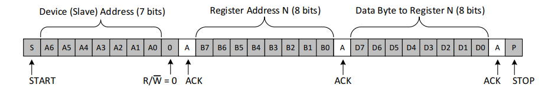
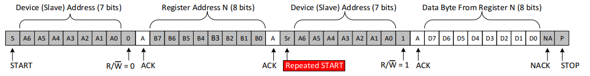
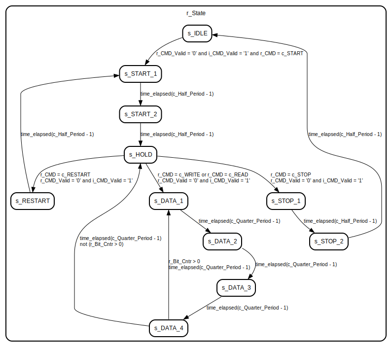

# Introduction

I2C, which stands for Inter-Integrated Circuit, is a widely used communication protocol that enables digital communication between electronic devices. It was developed by Philips (now NXP Semiconductors) and has become a de facto standard for communication between integrated circuits, particularly for connecting sensors, displays, EEPROMs, and other low-speed peripherals.

Here are some key aspects of the I2C protocol:

1. **Two-Wire Communication**: I2C uses only two wires for communication - one for data (SDA or Serial Data) and one for clock (SCL or Serial Clock). This simplicity makes it a popular choice for many applications.

2. **Master-Slave Architecture**: In I2C communication, devices are categorized as either "masters" or "slaves." The master device initiates and controls the communication, while the slave devices respond to the master's requests.

3. **Addressing**: Each I2C device has a unique 7-bit or 10-bit address. The 7-bit address space can accommodate up to 128 devices (0x00 to 0x7F), while the 10-bit addressing allows for more extensive addressing if needed.

4. **Start and Stop Conditions**: Communication begins with a "Start" condition (S) and ends with a "Stop" condition (P). These are special sequences of signal transitions that indicate the start and end of a data transfer.

5. **Data Transmission**: Data is transferred in 8-bit bytes. After the start condition, the master sends the address of the slave it wants to communicate with, followed by a read or write bit. Then, data bytes are sent or received, and the sender acknowledges the receipt of each byte.

6. **Clock Synchronization**: The SCL line is used to synchronize data transmission. Data bits on the SDA line are read or written on the rising or falling edge of the SCL signal, depending on the device and the phase.

7. **Acknowledge (ACK) Bit**: After receiving a byte of data, the receiver (either master or slave) sends an ACK bit to indicate successful data reception. If the sender does not receive an ACK, it can abort the communication.

8. **Clock Speed**: I2C supports various clock speeds, commonly ranging from 100 kHz to 400 kHz in standard mode and up to 3.4 MHz in high-speed mode. There's also a newer Ultra-Fast mode with speeds up to 5 MHz.

9. **Multi-Master Support**: I2C allows for multiple master devices on the same bus, which can take control of the bus as needed. This feature enables more complex communication topologies.

10. **Bus Arbitration**: When two masters try to communicate simultaneously, I2C uses a form of arbitration to resolve conflicts and allow one master to continue while the other backs off.

## Data Frame

The data frame used in the I2C (Inter-Integrated Circuit) protocol defines how data is structured and transmitted between devices on the I2C bus. The data frame in I2C communication typically consists of several components:

1. **Start Condition (S)**: The data frame begins with a Start condition (S), which is a special sequence of signal transitions. It indicates the start of a new data transfer. The SDA line transitions from high to low while the SCL line is high.

2. **7-bit Address**: After the Start condition, the 7-bit address of the target device is transmitted. The most significant bit (MSB) is sent first, followed by the 6 remaining bits. The last bit of the address is the Read/Write (R/W) bit. A logic '1' in the R/W bit indicates a read operation, while a logic '0' indicates a write operation.

3. **Acknowledge Bit (ACK)**: After the address byte, the master device releases control of the SDA line, and the target slave device sends an Acknowledge bit (ACK). If the slave acknowledges, it pulls the SDA line low. If there is no acknowledgment, the SDA line remains high, indicating a NACK (No Acknowledge).

4. **Data Bytes**: Following the address and Acknowledge bit, one or more data bytes are transmitted. Each data byte consists of 8 bits, with the most significant bit (MSB) sent first. The data bytes can be read from or written to the slave device. After each byte, an Acknowledge bit is sent by the receiving device to indicate successful reception.

5. **Stop Condition (P)**: The data frame concludes with a Stop condition (P). This is another special sequence of signal transitions, indicating the end of the data transfer. The Stop condition is initiated when the SDA line transitions from low to high while the SCL line is high.

Here is an Example I2C Write to Slave Device's Registe:

and also an Example I2C Read from Slave Device's Register

It's important to note that I2C devices can send or receive multiple data bytes in a single data frame. The number of bytes transferred can vary depending on the specific application and the device's requirements. Also, I2C supports 10-bit addressing as an extension to the standard 7-bit addressing, which allows for a larger number of devices on the bus. In the case of 10-bit addressing, the frame structure is slightly different, with additional address bits.

The Start and Stop conditions are critical for signaling the beginning and end of a data transfer, while the Acknowledge bit is essential for confirming the successful reception of data bytes. These elements ensure the integrity and synchronization of the communication between I2C devices on the bus.

## Aplication

The I2C (Inter-Integrated Circuit) protocol is used in a wide range of applications across various industries. Its versatility and simplicity make it well-suited for connecting integrated circuits and peripherals. Here are some common applications of I2C:

1. **Sensor Interfacing**: I2C is frequently used to connect sensors, such as temperature sensors, humidity sensors, accelerometers, gyroscopes, and magnetometers to microcontrollers and microprocessors. These sensors provide data for applications like environmental monitoring, motion detection, and more.

2. **Displays**: OLED and LCD displays often use I2C for communication, allowing for easy integration into various devices, from small screens on wearable devices to larger screens on IoT products.

3. **Memory Devices**: I2C EEPROMs (Electrically Erasable Programmable Read-Only Memory) are used for data storage in applications where non-volatile memory is required, such as in battery-backed RAM or configuration storage.

4. **Real-Time Clocks (RTCs)**: I2C RTCs are commonly used to keep track of time and date information in systems that require accurate timestamps. These include applications like data logging and scheduling.

5. **Audio Devices**: Some audio codecs and digital-to-analog converters (DACs) use I2C for control and configuration in audio equipment and audio-related applications.

6. **Power Management**: I2C is used to communicate with power management ICs and voltage regulators, allowing for dynamic power control and management in systems to optimize power consumption.

7. **Communication Interfaces**: In some cases, I2C is used to interface with other communication modules or devices. For example, I2C can be used to configure and communicate with radio transceivers in wireless communication systems.

8. **Integrated Sensors and Modules**: Many integrated sensor modules, such as IMUs (Inertial Measurement Units) and environmental sensor modules, combine multiple sensors and use I2C as the communication interface. These modules simplify the integration of complex sensor systems.

9. **IoT Devices**: In Internet of Things (IoT) applications, I2C can be used to connect various sensors, display devices, and controllers in a compact and power-efficient manner. It is commonly found in smart home devices, wearable technology, and sensor nodes.

10. **Automotive Electronics**: I2C is used in automotive applications for sensors and control modules. It can be found in systems such as engine management, airbag systems, and climate control.

11. **Industrial Control**: I2C can be used in industrial control systems to interface with sensors and control components, providing data for process monitoring and automation.

12. **Consumer Electronics**: I2C is utilized in various consumer electronic devices, including smartphones, tablets, and digital cameras, for tasks like interfacing with sensors and controlling peripherals.

13. **Medical Devices**: Some medical devices, such as pulse oximeters and blood pressure monitors, use I2C for sensor communication and data transfer.

14. **Gaming Consoles**: I2C is used in gaming consoles for interfacing with controllers and accessories.

15. **Automated Test Equipment**: I2C is employed in test equipment for configuration and control purposes.

These are just a few examples of the many applications of I2C. Its ability to enable efficient communication between various components makes it a popular choice for connecting a wide range of devices in both consumer and industrial settings.

## Pros of I2C

1. **Two-Wire Communication**: The use of only two wires simplifies hardware connections, making it suitable for systems with limited pins and PCB space.

2. **Multi-Device Communication**: I2C supports multiple devices on a single bus, which reduces the number of connections needed in a system, making it efficient for connecting numerous peripherals.

3. **Addressing**: Each device has a unique address, allowing for straightforward device selection and communication.

4. **Standardized Protocol**: I2C is a well-established and widely adopted protocol, ensuring compatibility between different manufacturers' devices.

5. **Multi-Master Support**: I2C allows multiple master devices on the same bus, making it suitable for complex systems where multiple controllers need to communicate.

6. **Clock Speed Options**: I2C offers flexibility in choosing clock speeds, allowing you to balance between data rate and power consumption.

7. **Low Power Consumption**: I2C devices are designed to consume minimal power when idle, making it suitable for battery-powered devices and energy-efficient systems.

8. **Hot-Plugging**: Devices can be added or removed from the bus without disrupting the communication between existing devices.

## Cons of I2C

1. **Limited Distance**: I2C is not suitable for long-distance communication due to its susceptibility to noise and capacitance effects on the bus. It's typically used for short-distance communication within a device or on a PCB.

2. **Clock Stretching**: Some I2C devices may hold the clock line (SCL) low to slow down communication, causing potential timing issues.

3. **Complexity for Multi-Master**: While I2C supports multi-master communication, handling bus arbitration and collision resolution can be complex in such scenarios.

4. **Lower Speed**: I2C may not be the best choice for applications that require very high data transfer rates because other protocols like SPI or UART can offer higher speeds.

5. **No Native Error Detection**: I2C lacks built-in error-checking mechanisms, which can make troubleshooting communication issues more challenging.

6. **Pull-Up Resistors Required**: To maintain the signal integrity, I2C typically requires pull-up resistors on the SDA and SCL lines, adding some hardware complexity.

7. **Compatibility Concerns**: While I2C is a standard protocol, different devices may have slight variations in their implementation, which can sometimes lead to compatibility issues.

# Entity: I2C_Master 
- **File**: i2c_master.vhd

## Diagram

## Generics

| Generic name | Type    | Value | Description |
| ------------ | ------- | ----- | ----------- |
| g_Sys_Freq   | integer | 1e8   |             |
| g_I2C_Freq   | integer | 4e5   |             |

## Ports

| Port name      | Direction | Type                         | Description |
| -------------- | --------- | ---------------------------- | ----------- |
| i_Clk          | in        | std_logic                    |             |
| i_CMD_Valid    | in        | std_logic                    |             |
| i_Last_Rd_Byte | in        | std_logic                    |             |
| i_CMD          | in        | std_logic_vector(2 downto 0) |             |
| i_Data_In      | in        | std_logic_vector(7 downto 0) |             |
| o_Data_Out     | out       | std_logic_vector(7 downto 0) |             |
| o_Ack          | out       | std_logic                    |             |
| o_Busy         | out       | std_logic                    |             |
| o_Done         | out       | std_logic                    |             |
| o_SCL          | out       | std_logic                    |             |
| io_SDA         | inout     | std_logic                    |             |

## Signals

| Name             | Type                                 | Description |
| ---------------- | ------------------------------------ | ----------- |
| r_State          | t_States                             |             |
| r_CMD_Valid      | std_logic                            |             |
| r_CMD            | std_logic_vector(2 downto 0)         |             |
| r_Tri_Slct       | std_logic                            |             |
| r_Busy           | std_logic                            |             |
| r_Done           | std_logic                            |             |
| r_SCL            | std_logic                            |             |
| r_SDA            | std_logic                            |             |
| r_Rx_Shift_Reg   | std_logic_vector(8 downto 0)         |             |
| r_Tx_Shift_Reg   | std_logic_vector(8 downto 0)         |             |
| r_Bit_Cntr       | integer range 0 to 8                 |             |
| r_Bit_Width_Cntr | integer range 0 to c_Half_Period - 1 |             |

## Constants

| Name             | Type                         | Value                           | Description |
| ---------------- | ---------------------------- | ------------------------------- | ----------- |
| c_Half_Period    | integer                      | (g_Sys_Freq / (2 * g_I2C_Freq)) |             |
| c_Quarter_Period | integer                      | (g_Sys_Freq / (4 * g_I2C_Freq)) |             |
| c_START          | std_logic_vector(2 downto 0) | "000"                           |             |
| c_WRITE          | std_logic_vector(2 downto 0) | "001"                           |             |
| c_READ           | std_logic_vector(2 downto 0) | "010"                           |             |
| c_STOP           | std_logic_vector(2 downto 0) | "011"                           |             |
| c_RESTART        | std_logic_vector(2 downto 0) | "100"                           |             |

## Types

| Name     | Type                                                                                                                                                                                                                                                                                                                                                                                                                                                                                                                                  | Description |
| -------- | ------------------------------------------------------------------------------------------------------------------------------------------------------------------------------------------------------------------------------------------------------------------------------------------------------------------------------------------------------------------------------------------------------------------------------------------------------------------------------------------------------------------------------------- | ----------- |
| t_States | (s_IDLE,  s_START_1,  s_START_2,  s_HOLD,  s_STOP_1,  s_STOP_2,  s_RESTART,  s_DATA_1,  s_DATA_2,  s_DATA_3,  s_DATA_4,  s_DATA_END) |             |

## Processes
- unnamed: ( i_Clk )

## State machines

