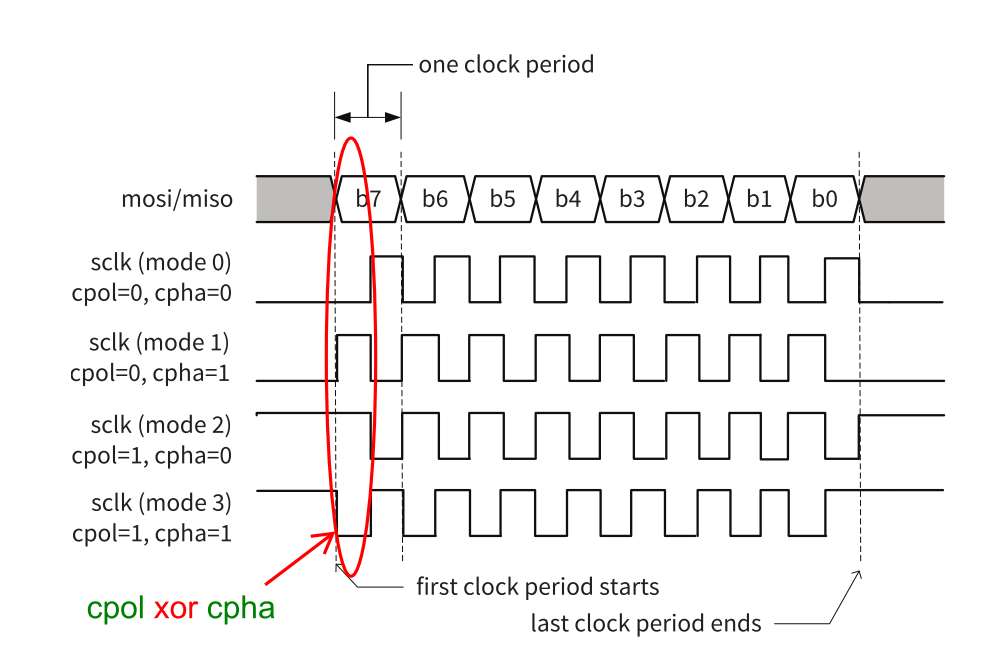
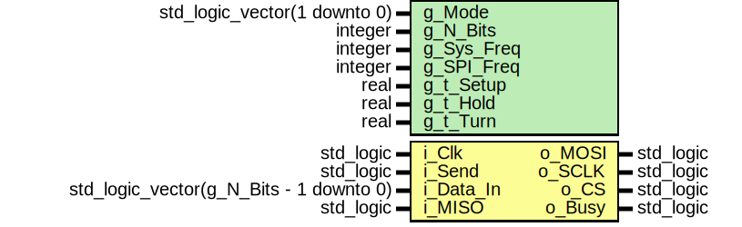
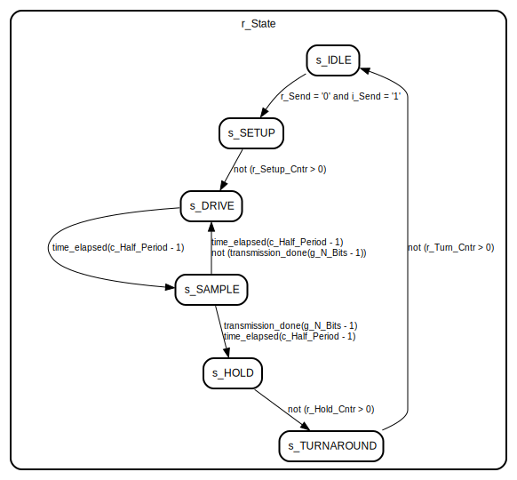
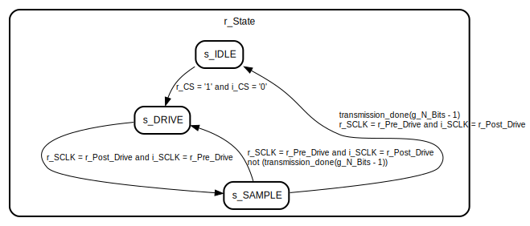

# Introduction
SPI, which stands for Serial Peripheral Interface, is a synchronous serial communication protocol used for communicating between microcontrollers, sensors, and various peripheral devices. It is widely used in embedded systems and is known for its simplicity and efficiency.

## Modes of Operation
SPI (Serial Peripheral Interface) operates in several modes, which determine the clock polarity and phase relationship between the master and slave devices. These modes are often referred to as "SPI modes" or "clock modes." The four main SPI modes are defined by two parameters: Clock Polarity (CPOL) and Clock Phase (CPHA). Here's an explanation of each mode:

1. **Mode 0 (CPOL=0, CPHA=0)**:
   - Clock Polarity (CPOL) is 0, meaning the clock is idle low (low when not in use).
   - Clock Phase (CPHA) is 0, meaning data is sampled on the leading edge (rising edge) of the clock signal.
   - Data is typically sampled on the rising edge of the clock, and the data is stable between falling edges. This is a common and widely used mode.

2. **Mode 1 (CPOL=0, CPHA=1)**:
   - Clock Polarity (CPOL) is 0 (idle low).
   - Clock Phase (CPHA) is 1, meaning data is sampled on the trailing edge (falling edge) of the clock signal.
   - Data is typically sampled on the falling edge of the clock, and the data changes between rising edges.

3. **Mode 2 (CPOL=1, CPHA=0)**:
   - Clock Polarity (CPOL) is 1, meaning the clock is idle high (high when not in use).
   - Clock Phase (CPHA) is 0, meaning data is sampled on the leading edge (falling edge) of the clock signal.
   - Data is sampled on the falling edge of the clock, and the data is stable between rising edges.

4. **Mode 3 (CPOL=1, CPHA=1)**:
   - Clock Polarity (CPOL) is 1 (idle high).
   - Clock Phase (CPHA) is 1, meaning data is sampled on the trailing edge (rising edge) of the clock signal.
   - Data is sampled on the rising edge of the clock, and the data changes between falling edges.

SPI devices communicate using one of these modes, and both the master and slave devices must be configured to use the same mode for successful communication. The choice of mode depends on the specific requirements of the devices being used and the communication protocol they support.

# Entity: SPI_Master 
- **File**: spi_master.vhd

## Diagram

## Generics

| Generic name | Type                         | Value | Description |
| ------------ | ---------------------------- | ----- | ----------- |
| g_Mode       | std_logic_vector(1 downto 0) | "00"  |             |
| g_N_Bits     | integer                      | 8     |             |
| g_Sys_Freq   | integer                      | 1e8   |             |
| g_SPI_Freq   | integer                      | 4e5   |             |
| g_t_Setup    | real                         | 0.0   |             |
| g_t_Hold     | real                         | 0.0   |             |
| g_t_Turn     | real                         | 0.0   |             |

## Ports

| Port name | Direction | Type                                    | Description |
| --------- | --------- | --------------------------------------- | ----------- |
| i_Clk     | in        | std_logic                               |             |
| i_Send    | in        | std_logic                               |             |
| i_Data_In | in        | std_logic_vector(g_N_Bits - 1 downto 0) |             |
| i_MISO    | in        | std_logic                               |             |
| o_MOSI    | out       | std_logic                               |             |
| o_SCLK    | out       | std_logic                               |             |
| o_CS      | out       | std_logic                               |             |
| o_Busy    | out       | std_logic                               |             |

## Signals

| Name               | Type                                    | Description |
| ------------------ | --------------------------------------- | ----------- |
| r_State            | t_States                                |             |
| r_Send             | std_logic                               |             |
| r_MOSI             | std_logic                               |             |
| r_SCLK             | std_logic                               |             |
| r_CS               | std_logic                               |             |
| r_Busy             | std_logic                               |             |
| r_Shift_Reg        | std_logic_vector(g_N_Bits - 1 downto 0) |             |
| r_Half_Period_Cntr | integer range 0 to c_Half_Period - 1    |             |
| r_Setup_Max        | integer                                 |             |
| r_Hold_Max         | integer                                 |             |
| r_Turn_Max         | integer                                 |             |
| r_Setup_Cntr       | integer                                 |             |
| r_Hold_Cntr        | integer                                 |             |
| r_Turn_Cntr        | integer                                 |             |
| r_Bit_Cntr         | integer range 0 to g_N_Bits - 1         |             |

## Constants

| Name          | Type    | Value                           | Description |
| ------------- | ------- | ------------------------------- | ----------- |
| c_Half_Period | integer | (g_Sys_Freq / (2 * g_SPI_Freq)) |             |

## Types

| Name     | Type                                                                                                                                                                                                                                           | Description |
| -------- | ---------------------------------------------------------------------------------------------------------------------------------------------------------------------------------------------------------------------------------------------- | ----------- |
| t_States | (s_IDLE,  s_SETUP,  s_DRIVE,  s_SAMPLE,  s_HOLD,  s_TURNAROUND) |             |

## Processes
- unnamed: ( i_Clk )

## State machines

# Entity: SPI_Slave 
- **File**: spi_slave.vhd

## Diagram

## Generics

| Generic name | Type                         | Value | Description |
| ------------ | ---------------------------- | ----- | ----------- |
| g_Mode       | std_logic_vector(1 downto 0) | "00"  |             |
| g_N_Bits     | integer                      | 8     |             |

## Ports

| Port name | Direction | Type      | Description |
| --------- | --------- | --------- | ----------- |
| i_Clk     | in        | std_logic |             |
| i_MOSI    | in        | std_logic |             |
| i_SCLK    | in        | std_logic |             |
| i_CS      | in        | std_logic |             |
| o_MISO    | out       | std_logic |             |

## Signals

| Name         | Type                                    | Description |
| ------------ | --------------------------------------- | ----------- |
| r_State      | t_States                                |             |
| r_CS         | std_logic                               |             |
| r_MISO       | std_logic                               |             |
| r_Shift_Reg  | std_logic_vector(g_N_Bits - 1 downto 0) |             |
| r_SCLK       | std_logic                               |             |
| r_Post_Drive | std_logic                               |             |
| r_Pre_Drive  | std_logic                               |             |
| r_Bit_Cntr   | integer range 0 to g_N_Bits - 1         |             |

## Types

| Name     | Type                                                                                                | Description |
| -------- | --------------------------------------------------------------------------------------------------- | ----------- |
| t_States | (s_IDLE,  s_DRIVE,  s_SAMPLE) |             |

## Processes
- unnamed: ( i_CLK )

## State machines

