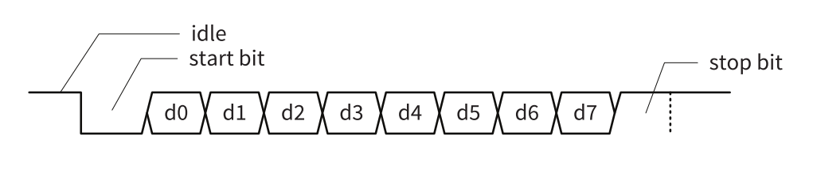
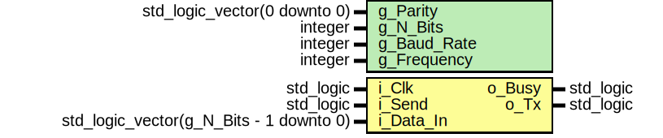
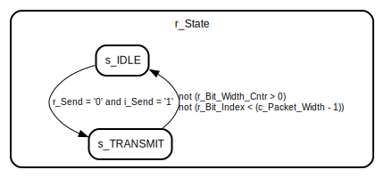
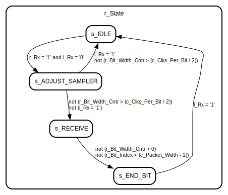

# Introduction
UART, which stands for Universal Asynchronous Receiver/Transmitter, is a hardware communication protocol used for serial communication between devices. It's a widely used interface in electronics, especially in microcontrollers, embedded systems, and computer peripherals. UART allows for the transfer of data between devices one bit at a time, and it's often used for tasks like data transmission, configuration, and debugging.

UART is a simple and widely used serial communication protocol that offers versatility and ease of implementation. It's well-suited for many applications, but its limitations in terms of data rate and noise immunity may make it less suitable for high-speed or long-distance communication

## Data Frame
In UART communication, data is transmitted in packets known as "frames." Each UART frame consists of several components, including the start bit, data bits, optional parity bit, and stop bit(s).



Here's a breakdown of the components of a UART frame:

1. **Start BitTh**: e start bit is always the first bit in a UART frame. It indicates the beginning of a data transmission. Its purpose is to inform the receiving device that a new data word is coming.

2. **Data Bits**: Data bits represent the actual information being transmitted. The number of data bits in a frame can vary, commonly being 7 or 8 bits. In some cases, it can be 5 or 6 bits.

3. **Parity Bit (optional)**: The parity bit is optional and is used for error-checking purposes. It can be set to odd, even, or none (no parity). The parity bit is used to ensure data integrity by making the total number of 1s in the frame either odd or even, depending on the chosen parity.

4. **Stop Bit(s)**: The stop bit is used to signal the end of a data frame. There can be one or more stop bits. The most common configuration is one stop bit. Additional stop bits can provide better noise immunity but increase the time per frame.

The baud rate is a critical parameter in UART communication. It determines the rate at which data bits are transmitted over the communication link. The baud rate is expressed in bits per second (bps) and is often configured at a specific value to ensure that both the transmitter and receiver operate at the same speed. The baud rate defines the duration of each bit within the frame. For example, if the baud rate is set to 9600 bps, each bit lasts approximately 104.17 microseconds.

## Baud Rate

The baud rate, often expressed in bits per second (bps), determines the speed at which these bits are transmitted.
It's important for both the transmitting and receiving devices to be configured with the same baud rate. Mismatched baud rates can lead to data reception errors because the devices won't be synchronized, and bits may be sampled at the wrong times.


# Simulation
- Listing all tests
```
python .\run.py -l
```

- Running UART_Tx test
```
python .\run.py -g vw_lib.uart_tb.test_uart_tx
```

- Running UART_Rx test
```
python .\run.py -g vw_lib.uart_tb.test_uart_rx
```


# Entity: UART_Tx 
- **File**: UART_Tx.vhd

## Diagram

## Generics

| Generic name | Type                         | Value  | Description |
| ------------ | ---------------------------- | ------ | ----------- |
| g_Parity     | std_logic_vector(0 downto 0) | "0"    |             |
| g_N_Bits     | integer                      | 8      |             |
| g_Baud_Rate  | integer                      | 230400 |             |
| g_Frequency  | integer                      | 1e8    |             |

## Ports

| Port name | Direction | Type                                    | Description |
| --------- | --------- | --------------------------------------- | ----------- |
| i_Clk     | in        | std_logic                               |             |
| i_Send    | in        | std_logic                               |             |
| i_Data_In | in        | std_logic_vector(g_N_Bits - 1 downto 0) |             |
| o_Busy    | out       | std_logic                               |             |
| o_Tx      | out       | std_logic                               |             |

## Signals

| Name             | Type                                          | Description |
| ---------------- | --------------------------------------------- | ----------- |
| r_State          | t_States                                      |             |
| r_Send           | std_logic                                     |             |
| r_Data_In        | std_logic_vector(g_N_Bits - 1 downto 0)       |             |
| r_Busy           | std_logic                                     |             |
| r_Tx             | std_logic                                     |             |
| r_Parity_Bit     | std_logic                                     |             |
| r_Packet         | std_logic_vector(c_Packet_Width - 1 downto 0) |             |
| r_Bit_Index      | integer range 0 to (c_Packet_Width - 1)       |             |
| r_Bit_Width_Cntr | integer range 0 to (c_Clks_Per_Bit - 1)       |             |

## Constants

| Name           | Type    | Value                                                | Description |
| -------------- | ------- | ---------------------------------------------------- | ----------- |
| c_Clks_Per_Bit | integer | integer(ceil(real(g_Frequency) / real(g_Baud_Rate))) |             |
| c_Packet_Width | integer | g_N_Bits + 2 + to_integer(unsigned(g_Parity))        |             |

## Types

| Name     | Type                                                                                             | Description |
| -------- | ------------------------------------------------------------------------------------------------ | ----------- |
| t_States | (s_IDLE,<br><span style="padding-left:20px"> s_TRANSMIT,<br><span style="padding-left:20px"> s2) |             |

## Processes
- unnamed: ( i_Clk )

## State machines



# Entity: UART_Rx 
- **File**: UART_Rx.vhd

## Diagram

## Generics

| Generic name | Type                         | Value | Description |
| ------------ | ---------------------------- | ----- | ----------- |
| g_Parity     | std_logic_vector(0 downto 0) | "0"   |             |
| g_N_Bits     | integer                      | 8     |             |
| g_Baud_Rate  | integer                      | 9600  |             |
| g_Frequency  | integer                      | 1e8   |             |

## Ports

| Port name  | Direction | Type                                      | Description |
| ---------- | --------- | ----------------------------------------- | ----------- |
| i_Clk      | in        | std_logic                                 |             |
| i_Rx       | in        | std_logic                                 |             |
| o_Valid    | out       | std_logic                                 |             |
| o_Busy     | out       | std_logic                                 |             |
| o_Data_Out | out       | std_logic_vector((g_N_Bits - 1) downto 0) |             |

## Signals

| Name             | Type                                            | Description |
| ---------------- | ----------------------------------------------- | ----------- |
| r_State          | t_States                                        |             |
| r_Parity_Bit     | std_logic                                       |             |
| r_Rx             | std_logic                                       |             |
| r_Valid          | std_logic                                       |             |
| r_Busy           | std_logic                                       |             |
| r_Data_Out       | std_logic_vector((c_Packet_Width - 1) downto 0) |             |
| r_Bit_Index      | integer range 0 to (c_Packet_Width - 1)         |             |
| r_Bit_Width_Cntr | integer range 0 to (c_Clks_Per_Bit - 1)         |             |

## Constants

| Name           | Type    | Value                                                | Description |
| -------------- | ------- | ---------------------------------------------------- | ----------- |
| c_Clks_Per_Bit | integer | integer(ceil(real(g_Frequency) / real(g_Baud_Rate))) |             |
| c_Packet_Width | integer | g_N_Bits + 1 + to_integer(unsigned(g_Parity))        |             |

## Types

| Name     | Type                                                                                                                                                         | Description |
| -------- | ------------------------------------------------------------------------------------------------------------------------------------------------------------ | ----------- |
| t_States | (s_IDLE,<br><span style="padding-left:20px"> s_ADJUST_SAMPLER,<br><span style="padding-left:20px"> s_RECEIVE,<br><span style="padding-left:20px"> s_END_BIT) |             |

## Processes
- unnamed: ( i_Clk )

## State machines

