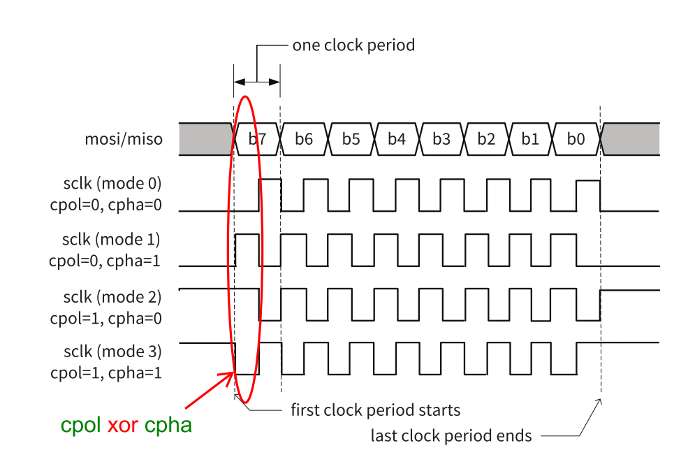
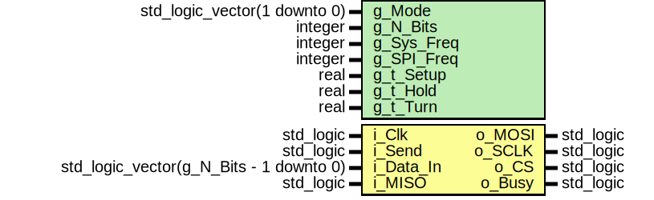
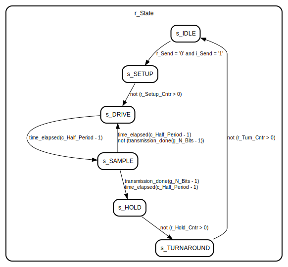
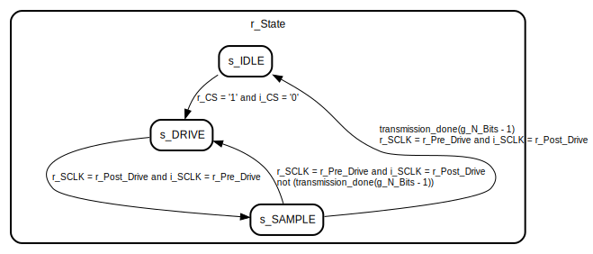

# Introduction
SPI, which stands for Serial Peripheral Interface, is a synchronous serial communication protocol used for communicating between microcontrollers, sensors, and various peripheral devices. It is widely used in embedded systems and is known for its simplicity and efficiency.

## Modes of Operation
SPI (Serial Peripheral Interface) operates in several modes, which determine the clock polarity and phase relationship between the master and slave devices. These modes are often referred to as "SPI modes" or "clock modes." The four main SPI modes are defined by two parameters: Clock Polarity (CPOL) and Clock Phase (CPHA). Here's an explanation of each mode:

1. **Mode 0 (CPOL=0, CPHA=0)**:
   - Clock Polarity (CPOL) is 0, meaning the clock is idle low (low when not in use).
   - Clock Phase (CPHA) is 0, meaning data is sampled on the leading edge (rising edge) of the clock signal.
   - Data is typically sampled on the rising edge of the clock, and the data is stable between falling edges. This is a common and widely used mode.

2. **Mode 1 (CPOL=0, CPHA=1)**:
   - Clock Polarity (CPOL) is 0 (idle low).
   - Clock Phase (CPHA) is 1, meaning data is sampled on the trailing edge (falling edge) of the clock signal.
   - Data is typically sampled on the falling edge of the clock, and the data changes between rising edges.

3. **Mode 2 (CPOL=1, CPHA=0)**:
   - Clock Polarity (CPOL) is 1, meaning the clock is idle high (high when not in use).
   - Clock Phase (CPHA) is 0, meaning data is sampled on the leading edge (falling edge) of the clock signal.
   - Data is sampled on the falling edge of the clock, and the data is stable between rising edges.

4. **Mode 3 (CPOL=1, CPHA=1)**:
   - Clock Polarity (CPOL) is 1 (idle high).
   - Clock Phase (CPHA) is 1, meaning data is sampled on the trailing edge (rising edge) of the clock signal.
   - Data is sampled on the rising edge of the clock, and the data changes between falling edges.

SPI devices communicate using one of these modes, and both the master and slave devices must be configured to use the same mode for successful communication. The choice of mode depends on the specific requirements of the devices being used and the communication protocol they support.

## Aplication
The Serial Peripheral Interface (SPI) protocol finds a wide range of applications in various industries due to its simplicity, speed, and flexibility. Here are some common applications of SPI:

1. **Data Acquisition and Sensors**:
   - SPI is frequently used to interface microcontrollers with sensors and data acquisition devices. These sensors can include temperature sensors, pressure sensors, accelerometers, gyroscopes, and more. SPI allows for high-speed and accurate data transfer between the sensor and the microcontroller.

2. **Flash Memory and Storage**:
   - Many flash memory chips, including EEPROMs and SD cards, use SPI for data storage and retrieval. SPI's speed and simplicity make it a suitable choice for non-volatile memory storage.

3. **Display Modules**:
   - SPI is commonly used to control various types of display modules, such as TFT LCDs, OLED displays, and LED matrix displays. It enables the microcontroller to send data to the display to render graphics and text.

4. **Digital-to-Analog Converters (DAC)**:
   - SPI is employed for interfacing microcontrollers with DACs to convert digital signals into analog voltages. This is essential for applications requiring precise control of analog outputs, such as audio equipment and industrial automation.

5. **Analog-to-Digital Converters (ADC)**:
   - In applications where analog signals need to be converted to digital data, SPI can be used to interface microcontrollers with ADCs. This is crucial in areas like instrumentation, medical devices, and industrial control systems.

6. **Wireless Communication Modules**:
   - Some wireless communication modules, like LoRa and RF transceivers, use SPI for configuring and transmitting data. SPI allows for efficient communication with such modules for IoT (Internet of Things) and remote monitoring applications.

7. **Real-Time Clock (RTC) Modules**:
   - RTC modules, which are used in various applications like timing and logging, often communicate with microcontrollers via SPI to keep accurate time and date records.

8. **Motor Control**:
   - In motor control applications, SPI can be used to interface microcontrollers with motor drivers and controllers, allowing for precise control of motor speed and direction.

9. **Networking Devices**:
   - Some networking devices, like Ethernet controllers and Ethernet switches, use SPI for configuration and communication with microcontrollers in embedded network solutions.

10. **Radio Frequency (RF) Communication**:
    - SPI is utilized in various RF communication applications, particularly for configuring and controlling RF transceivers and modules.

11. **Security and Encryption**:
    - Cryptographic modules, like hardware security chips and secure elements, use SPI for secure data communication and encryption in applications that require data protection and authentication.

12. **Automotive Electronics**:
    - SPI is used in various automotive applications, including engine control units (ECUs), airbag systems, and dashboard displays. It enables communication between microcontrollers and the numerous sensors and modules found in modern vehicles.

SPI's versatility and speed make it a popular choice for a wide range of applications, particularly in embedded systems and IoT devices where reliable and efficient communication between microcontrollers and peripheral devices is crucial.

## Pros

1. **High Speed**: SPI is a fast communication protocol that can achieve high data transfer rates. It operates in full-duplex mode, allowing data to be sent and received simultaneously, which contributes to its speed.

2. **Simplicity**: SPI is relatively simple to implement and understand, which makes it a popular choice for many applications. It typically uses only four wires for communication (SCK - Clock, MOSI - Master Out Slave In, MISO - Master In Slave Out, and SS/CS - Slave Select/Chip Select).

3. **Low Overhead**: SPI has minimal protocol overhead. It does not require complex addressing schemes or extensive error-checking mechanisms, which reduces the overhead and latency in data transmission.

4. **Multiple Slaves**: SPI supports multiple slave devices on the same bus. Each slave has a separate Slave Select (SS/CS) line, which allows the master to communicate with one slave at a time.

5. **Hardware Support**: Many microcontrollers and integrated circuits have built-in hardware support for SPI communication, making it a convenient choice for interfacing with peripherals.

## Cons

1. **Limited Distance**: SPI is designed for short-distance communication within a single circuit board or between closely located devices. It is not suitable for long-distance communication due to its susceptibility to noise and signal degradation over longer wires.

2. **No Standardized Protocol**: Unlike some other communication protocols like I2C or UART, SPI does not have a standardized protocol beyond the basic data transfer. This means that the details of communication (e.g., data format, clock polarity, phase) can vary between devices and manufacturers, which can lead to compatibility issues.

3. **Complex Wiring**: SPI can require a relatively large number of wires (four or more) for communication, which can be a disadvantage when compared to protocols like I2C or UART, which use fewer wires.

4. **Master-Slave Relationship**: SPI is typically a master-slave communication protocol, which means that a microcontroller or device acts as the master, and peripheral devices act as slaves. This hierarchical structure may not be suitable for all applications.

5. **Lack of Flow Control**: SPI lacks built-in flow control mechanisms. This means there is no way for the receiving device to signal the transmitting device to slow down or stop sending data if it's overwhelmed. Flow control must be implemented separately if needed.

# Entity: SPI_Master 
- **File**: spi_master.vhd

## Diagram

## Generics

| Generic name | Type                         | Value | Description |
| ------------ | ---------------------------- | ----- | ----------- |
| g_Mode       | std_logic_vector(1 downto 0) | "00"  |             |
| g_N_Bits     | integer                      | 8     |             |
| g_Sys_Freq   | integer                      | 1e8   |             |
| g_SPI_Freq   | integer                      | 4e5   |             |
| g_t_Setup    | real                         | 0.0   |             |
| g_t_Hold     | real                         | 0.0   |             |
| g_t_Turn     | real                         | 0.0   |             |

## Ports

| Port name | Direction | Type                                    | Description |
| --------- | --------- | --------------------------------------- | ----------- |
| i_Clk     | in        | std_logic                               |             |
| i_Send    | in        | std_logic                               |             |
| i_Data_In | in        | std_logic_vector(g_N_Bits - 1 downto 0) |             |
| i_MISO    | in        | std_logic                               |             |
| o_MOSI    | out       | std_logic                               |             |
| o_SCLK    | out       | std_logic                               |             |
| o_CS      | out       | std_logic                               |             |
| o_Busy    | out       | std_logic                               |             |

## Signals

| Name               | Type                                    | Description |
| ------------------ | --------------------------------------- | ----------- |
| r_State            | t_States                                |             |
| r_Send             | std_logic                               |             |
| r_MOSI             | std_logic                               |             |
| r_SCLK             | std_logic                               |             |
| r_CS               | std_logic                               |             |
| r_Busy             | std_logic                               |             |
| r_Shift_Reg        | std_logic_vector(g_N_Bits - 1 downto 0) |             |
| r_Half_Period_Cntr | integer range 0 to c_Half_Period - 1    |             |
| r_Setup_Max        | integer                                 |             |
| r_Hold_Max         | integer                                 |             |
| r_Turn_Max         | integer                                 |             |
| r_Setup_Cntr       | integer                                 |             |
| r_Hold_Cntr        | integer                                 |             |
| r_Turn_Cntr        | integer                                 |             |
| r_Bit_Cntr         | integer range 0 to g_N_Bits - 1         |             |

## Constants

| Name          | Type    | Value                           | Description |
| ------------- | ------- | ------------------------------- | ----------- |
| c_Half_Period | integer | (g_Sys_Freq / (2 * g_SPI_Freq)) |             |

## Types

| Name     | Type                                                                                                                                                                                                                                           | Description |
| -------- | ---------------------------------------------------------------------------------------------------------------------------------------------------------------------------------------------------------------------------------------------- | ----------- |
| t_States | (s_IDLE,  s_SETUP,  s_DRIVE,  s_SAMPLE,  s_HOLD,  s_TURNAROUND) |             |

## Processes
- unnamed: ( i_Clk )

## State machines

# Entity: SPI_Slave 
- **File**: spi_slave.vhd

## Diagram

## Generics

| Generic name | Type                         | Value | Description |
| ------------ | ---------------------------- | ----- | ----------- |
| g_Mode       | std_logic_vector(1 downto 0) | "00"  |             |
| g_N_Bits     | integer                      | 8     |             |

## Ports

| Port name | Direction | Type      | Description |
| --------- | --------- | --------- | ----------- |
| i_Clk     | in        | std_logic |             |
| i_MOSI    | in        | std_logic |             |
| i_SCLK    | in        | std_logic |             |
| i_CS      | in        | std_logic |             |
| o_MISO    | out       | std_logic |             |

## Signals

| Name         | Type                                    | Description |
| ------------ | --------------------------------------- | ----------- |
| r_State      | t_States                                |             |
| r_CS         | std_logic                               |             |
| r_MISO       | std_logic                               |             |
| r_Shift_Reg  | std_logic_vector(g_N_Bits - 1 downto 0) |             |
| r_SCLK       | std_logic                               |             |
| r_Post_Drive | std_logic                               |             |
| r_Pre_Drive  | std_logic                               |             |
| r_Bit_Cntr   | integer range 0 to g_N_Bits - 1         |             |

## Types

| Name     | Type                                                                                                | Description |
| -------- | --------------------------------------------------------------------------------------------------- | ----------- |
| t_States | (s_IDLE,  s_DRIVE,  s_SAMPLE) |             |

## Processes
- unnamed: ( i_CLK )

## State machines

