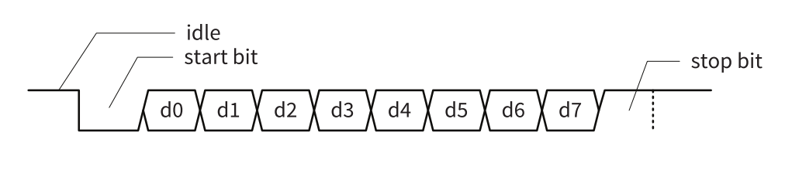
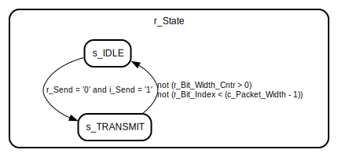
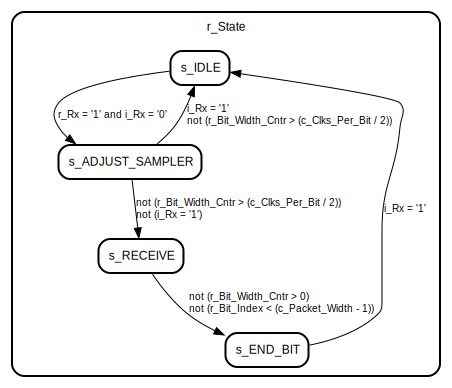

# Introduction
UART, which stands for Universal Asynchronous Receiver/Transmitter, is a hardware communication protocol used for serial communication between devices. It's a widely used interface in electronics, especially in microcontrollers, embedded systems, and computer peripherals. UART allows for the transfer of data between devices one bit at a time, and it's often used for tasks like data transmission, configuration, and debugging.

UART is a simple and widely used serial communication protocol that offers versatility and ease of implementation. It's well-suited for many applications, but its limitations in terms of data rate and noise immunity may make it less suitable for high-speed or long-distance communication

## Data Frame
In UART communication, data is transmitted in packets known as "frames." Each UART frame consists of several components, including the start bit, data bits, optional parity bit, and stop bit(s).

Here's a breakdown of the components of a UART frame:

1. **Start BitTh**: e start bit is always the first bit in a UART frame. It indicates the beginning of a data transmission. Its purpose is to inform the receiving device that a new data word is coming.

2. **Data Bits**: Data bits represent the actual information being transmitted. The number of data bits in a frame can vary, commonly being 7 or 8 bits. In some cases, it can be 5 or 6 bits.

3. **Parity Bit (optional)**: The parity bit is optional and is used for error-checking purposes. It can be set to odd, even, or none (no parity). The parity bit is used to ensure data integrity by making the total number of 1s in the frame either odd or even, depending on the chosen parity.

4. **Stop Bit(s)**: The stop bit is used to signal the end of a data frame. There can be one or more stop bits. The most common configuration is one stop bit. Additional stop bits can provide better noise immunity but increase the time per frame.

The baud rate is a critical parameter in UART communication. It determines the rate at which data bits are transmitted over the communication link. The baud rate is expressed in bits per second (bps) and is often configured at a specific value to ensure that both the transmitter and receiver operate at the same speed. The baud rate defines the duration of each bit within the frame. For example, if the baud rate is set to 9600 bps, each bit lasts approximately 104.17 microseconds.

## Baud Rate

The baud rate, often expressed in bits per second (bps), determines the speed at which these bits are transmitted.
It's important for both the transmitting and receiving devices to be configured with the same baud rate. Mismatched baud rates can lead to data reception errors because the devices won't be synchronized, and bits may be sampled at the wrong times.

## Application

UART (Universal Asynchronous Receiver/Transmitter) communication is widely used in various applications, particularly in embedded systems and communication between microcontrollers and peripherals. Here are some common applications of UART:

1. **Serial Communication between Microcontrollers and Peripherals**: UART is frequently used to connect microcontrollers to various peripherals, such as sensors, displays, GPS modules, and wireless modules. For example, you might use UART to communicate between an Arduino and a GPS module to receive location data.

2. **Console Communication**: UART is commonly used for console communication, especially in the context of programming and debugging. Devices like microcontrollers, single-board computers, and networking equipment often have UART interfaces that allow developers to access a command-line interface or log debugging information.

3. **Wireless Communication Modules**: Many wireless communication modules, like Bluetooth and Zigbee modules, use UART to interface with microcontrollers. This allows for wireless data transfer and control of devices such as Bluetooth headsets, home automation systems, and IoT devices.

4. **Data Logging and Telemetry**: In data logging applications, UART can be used to transmit data to a central logging system. For instance, environmental sensors in remote locations can transmit data via UART to a central data logger. Telemetry systems in fields like aviation and automotive also use UART for data transmission.

5. **Configuration and Firmware Updates**: UART is often used to configure and update the firmware of embedded systems. Devices can be programmed and configured via a UART connection, making it easier to modify and maintain the behavior of the device.

6. **Embedded Systems Debugging**: During the development and debugging phases of embedded systems, UART is crucial for accessing real-time information, including error messages, status updates, and debugging logs. This is especially important for debugging issues in systems that lack a user interface.

7. **Modem Communication**: UART has been used historically in modem communication, allowing computers to connect to the internet via dial-up. While this is less common today, it was a fundamental application in the past.

8. **Industrial Control and Automation**: In industrial settings, UART can be used for communication between programmable logic controllers (PLCs), human-machine interfaces (HMIs), and various sensors and actuators. It plays a key role in industrial automation and process control.

9. **GPS Devices**: UART is commonly employed to interface with GPS receivers for navigation, mapping, and geolocation applications. GPS modules send NMEA sentences over UART for processing by the host system.

10. **Robotics**: Many robotics applications use UART for communication between microcontrollers, sensors, and motor controllers. UART allows for real-time control and feedback in robotics systems.

11. **Home Automation**: Home automation systems often use UART for communication between smart devices, controllers, and hubs. This enables centralized control of lighting, climate, security, and other home functions.

12. **Medical Devices**: Some medical devices, such as patient monitors and diagnostic equipment, use UART for communication between the device and a central monitoring or control system.

These are just a few examples of the many applications of UART in various industries. UART's simplicity and versatility make it a go-to choice for serial communication, allowing different components and devices to exchange data and commands efficiently.

## Pros

1. **Simplicity:** UART is relatively simple to implement and understand, making it a popular choice for many applications, especially in embedded systems with limited resources.

2. **Versatility:** UART is a versatile communication protocol that can be used for various data transmission tasks, including sending and receiving data between devices, configuring devices, and debugging.

3. **Widely Supported:** UART is supported by a wide range of microcontrollers, microprocessors, and other embedded hardware, making it a de facto standard for serial communication.

4. **Asynchronous Communication:** UART is asynchronous, which means that data can be transmitted without the need for a shared clock signal between devices. This simplifies the interface between devices and allows for communication between devices with different clock frequencies.

5. **Bi-Directional:** UART allows for full-duplex communication, meaning data can be transmitted and received simultaneously.

## Cons

1. **Slower Data Rate:** UART communication tends to be slower compared to some other communication protocols like SPI (Serial Peripheral Interface) or I2C (Inter-Integrated Circuit). It's not suitable for high-speed data transfers.

2. **Limited Noise Immunity:** UART communication can be sensitive to electrical noise, which can lead to data errors, especially over long distances or in electrically noisy environments.

3. **No Acknowledgment:** UART is a simplex protocol, meaning it doesn't provide built-in acknowledgment of data receipt. If reliability is crucial, additional error-checking mechanisms need to be implemented at a higher level.

4. **Lack of Addressing:** UART doesn't provide a built-in addressing scheme, meaning devices need to have a predefined method for recognizing and filtering the data intended for them.

5. **Not Ideal for Multi-Device Communication:** UART is typically point-to-point or point-to-multipoint (one transmitter, multiple receivers) communication. It's not well-suited for systems with multiple devices transmitting data to each other simultaneously without collisions.

# Entity: UART_Tx 
- **File**: UART_Tx.vhd

## Diagram

## Generics

| Generic name | Type                         | Value  | Description |
| ------------ | ---------------------------- | ------ | ----------- |
| g_Parity     | std_logic_vector(0 downto 0) | "0"    |             |
| g_N_Bits     | integer                      | 8      |             |
| g_Baud_Rate  | integer                      | 230400 |             |
| g_Frequency  | integer                      | 1e8    |             |

## Ports

| Port name | Direction | Type                                    | Description |
| --------- | --------- | --------------------------------------- | ----------- |
| i_Clk     | in        | std_logic                               |             |
| i_Send    | in        | std_logic                               |             |
| i_Data_In | in        | std_logic_vector(g_N_Bits - 1 downto 0) |             |
| o_Busy    | out       | std_logic                               |             |
| o_Tx      | out       | std_logic                               |             |

## Signals

| Name             | Type                                          | Description |
| ---------------- | --------------------------------------------- | ----------- |
| r_State          | t_States                                      |             |
| r_Send           | std_logic                                     |             |
| r_Data_In        | std_logic_vector(g_N_Bits - 1 downto 0)       |             |
| r_Busy           | std_logic                                     |             |
| r_Tx             | std_logic                                     |             |
| r_Parity_Bit     | std_logic                                     |             |
| r_Packet         | std_logic_vector(c_Packet_Width - 1 downto 0) |             |
| r_Bit_Index      | integer range 0 to (c_Packet_Width - 1)       |             |
| r_Bit_Width_Cntr | integer range 0 to (c_Clks_Per_Bit - 1)       |             |

## Constants

| Name           | Type    | Value                                                | Description |
| -------------- | ------- | ---------------------------------------------------- | ----------- |
| c_Clks_Per_Bit | integer | integer(ceil(real(g_Frequency) / real(g_Baud_Rate))) |             |
| c_Packet_Width | integer | g_N_Bits + 2 + to_integer(unsigned(g_Parity))        |             |

## Types

| Name     | Type                                                                                             | Description |
| -------- | ------------------------------------------------------------------------------------------------ | ----------- |
| t_States | (s_IDLE,  s_TRANSMIT,  s2) |             |

## Processes
- unnamed: ( i_Clk )

## State machines

# Entity: UART_Rx 
- **File**: UART_Rx.vhd

## Diagram

## Generics

| Generic name | Type                         | Value | Description |
| ------------ | ---------------------------- | ----- | ----------- |
| g_Parity     | std_logic_vector(0 downto 0) | "0"   |             |
| g_N_Bits     | integer                      | 8     |             |
| g_Baud_Rate  | integer                      | 9600  |             |
| g_Frequency  | integer                      | 1e8   |             |

## Ports

| Port name  | Direction | Type                                      | Description |
| ---------- | --------- | ----------------------------------------- | ----------- |
| i_Clk      | in        | std_logic                                 |             |
| i_Rx       | in        | std_logic                                 |             |
| o_Valid    | out       | std_logic                                 |             |
| o_Busy     | out       | std_logic                                 |             |
| o_Data_Out | out       | std_logic_vector((g_N_Bits - 1) downto 0) |             |

## Signals

| Name             | Type                                            | Description |
| ---------------- | ----------------------------------------------- | ----------- |
| r_State          | t_States                                        |             |
| r_Parity_Bit     | std_logic                                       |             |
| r_Rx             | std_logic                                       |             |
| r_Valid          | std_logic                                       |             |
| r_Busy           | std_logic                                       |             |
| r_Data_Out       | std_logic_vector((c_Packet_Width - 1) downto 0) |             |
| r_Bit_Index      | integer range 0 to (c_Packet_Width - 1)         |             |
| r_Bit_Width_Cntr | integer range 0 to (c_Clks_Per_Bit - 1)         |             |

## Constants

| Name           | Type    | Value                                                | Description |
| -------------- | ------- | ---------------------------------------------------- | ----------- |
| c_Clks_Per_Bit | integer | integer(ceil(real(g_Frequency) / real(g_Baud_Rate))) |             |
| c_Packet_Width | integer | g_N_Bits + 1 + to_integer(unsigned(g_Parity))        |             |

## Types

| Name     | Type                                                                                                                                                         | Description |
| -------- | ------------------------------------------------------------------------------------------------------------------------------------------------------------ | ----------- |
| t_States | (s_IDLE,  s_ADJUST_SAMPLER,  s_RECEIVE,  s_END_BIT) |             |

## Processes
- unnamed: ( i_Clk )

## State machines

