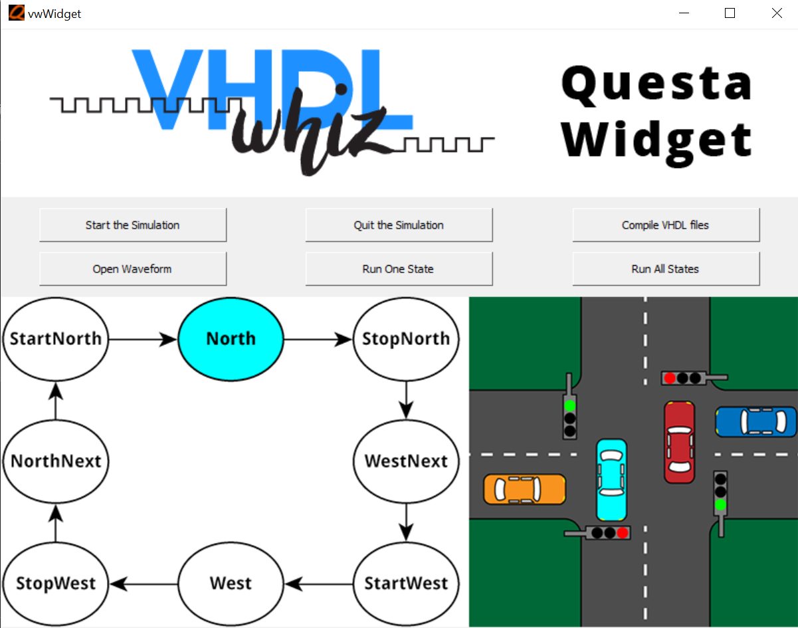

# Introduction

## Usage
1. Run the following command to open Questa/ModelSim
```
vsim -do .\vw_widget.tcl
```
2. Compile VHDL Files
3. Start the Simulations

## Reference
This project is based on **Tcl scripting for FPGA engineers** course in [VHDLwhiz Membership](https://academy.vhdlwhiz.com/products/vhdlwhiz-membership).
